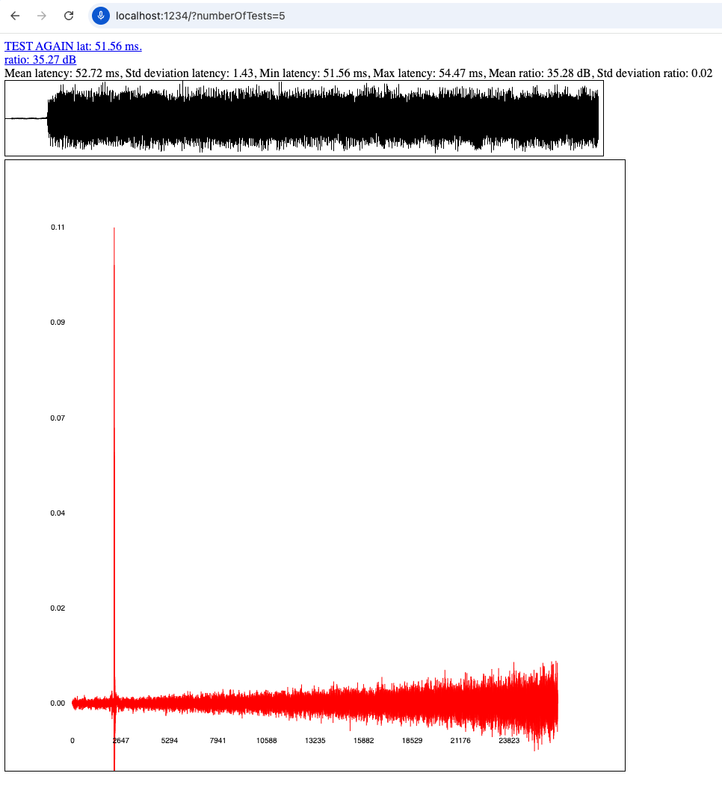
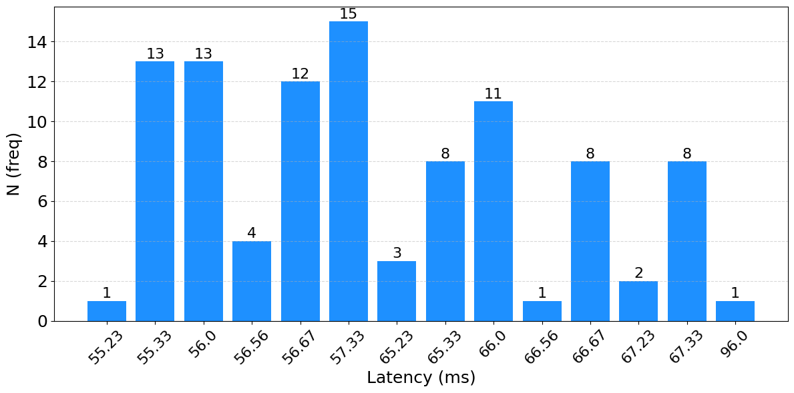

## About

The following repository is a Proof Of Concept to measure the round-trip latency in modern web browsers by using a [MLS (Maximum Length Sequence)](https://en.wikipedia.org/wiki/Maximum_length_sequence) signal (a type of noise). The app will play and record the MLS noise using the Web Audio API and will compute the cross-correlation to estimate the delay. Two graphs are displayed showing the resulting peak of the cross correlation and the waveform of audio data recorded. A histogram is also generated to facilitate analysis of the results when running the test multiple times in a row (see step 6 below). One of the objectives is to identify which browsers and operating systems yield the most stable results when it comes to measure the round-trip latency.

As a mechanism to validate if the test went well or not, the ratio operation is introduced to calculate the relation between the peak and the rest of the signal in terms of energy. In practice, a pre-defined fixed threshold set to +18dB is defined to consider the test successful, which means all ratios above that value are linked to a nice latency estimation and below are probably wrong.

The implementation of the proposed method is available as part of the [Hi-Audio online platform](https://hiaudio.fr)—an open-source, collaborative browser-based DAW—providing a practical demonstration of its applicability and integration in real-world web audio environments.

## How to run it locally:

Requirement: Node.js v14 or above

1. `git clone https://github.com/gilpanal/weblatencytest.git`
2. `cd weblatencytest`
3. `npm i`
4. `npm run dev`
5. Navigate to `localhost:1234`
6. To perform several tests in a row use athe following query param like this: `http://localhost:1234/?numberOfTests=5`

## Results and discussion

The table below presents the results of some experiments conducted for [the paper presented](https://hal.science/hal-05154354) at [WAC 25](https://wac-2025.ircam.fr/). Round-trip latency results were obtained over 100 consecutive tests for different browsers and systems. The table reports the mean latency, standard deviation, and the corresponding minimum and maximum values, all expressed in milliseconds (ms).

| **System / Browser**       | **Mean (ms)** | **Std. Dev. (ms)** | **Min (ms)** | **Max (ms)** |
|----------------------------|---------------|---------------------|--------------|--------------|
| **HP Ubuntu 22.04**        |               |                     |              |              |
| Chrome                     | 64.50         | 7.94                | 49.37        | 85.17        |
| Chromium                   | 64.15         | 8.21                | 41.41        | 76.44        |
| Firefox                    | 65.69         | 0.00                | 65.69        | 65.69        |
| **Lenovo Windows 10**      |               |                     |              |              |
| Edge                       | 60.82         | 6.06                | **55.23**    | **96.00**    |
| Chrome                     | 62.84         | 2.44                | 61.42        | 73.42        |
| Firefox                    | 104.65        | 0.00                | 104.65       | 104.65       |
| **MacBook Pro 2021**       |               |                     |              |              |
| Safari                     | 100.02        | 0.00                | 100.02       | 100.02       |
| Chrome                     | 52.33         | 1.14                | 49.98        | 52.88        |
| Firefox                    | 38.89         | 0.00                | 38.89        | 38.89        |

Firefox demonstrated the most stable performance, with the standard deviation frequently being zero or near-zero. This indicates that the latency values remained consistent across trials, which is a desirable characteristic for achieving accurate latency compensation. In contrast, Chromium-based browsers, such as Chrome and Edge, exhibited significantly greater variability, with standard deviations around 8 ms, particularly on systems such as Ubuntu, and Windows. Lastly, while Safari on macOS also exhibited good stability, the latency values were generally higher compared to those obtained with Firefox on the same system.

The following figure illustrates a representative case using a Lenovo laptop running Windows 10 and Microsoft Edge. The histogram shows latency values ranging from a minimum of 55.23 ms to a maximum of 96 ms. With a fluctuation margin of approximately 40 ms it becomes challenging to ensure effective latency compensation. This is especially problematic since the latency test is not typically run continuously by the user, making the behavior and variability of delay difficult to predict. 

---

Comparative table showing the round-trip latency values obtained in ms in different online DAWs using Firefox when recording a MLS signal. The first column contains the name of the application and the device and operating system where it runs. The second column is the round-trip latency obtained after cross-correlate the recorded MLS signal before DAW compensation. The third column is the value of the round-trip latency provided by the DAW. The fourth column is the remaining latency obtained by cross-correlation after latency compensation when recording again the MLS. For this last column the target value is 0.

| **Device / DAW app**  | **MLS latency no comp. (ms)** | **Latency estimation (ms)** | **MLS latency with comp. (ms)** |
| :-------------------- | ----------------------------: | --------------------------: | ------------------------------: |
| **HP Ubuntu 22.04**   |                               |                             |                                 |
| Soundtrap¹            |                       -175.46 |                         249 |                         -182.77 |
| Amped Studio²         |                         38.05 |                          69 |                          -11.38 |
| Bandlab               |                         65.12 |                         139 |                          -73.85 |
| WAM-online studio³    |                         96.96 |                       79.14 |                           58.66 |
| Hi-Audio              |                         66.64 |                       66.39 |                            0.68 |
| **Lenovo Windows 10** |                               |                             |                                 |
| Soundtrap¹            |                        -90.79 |                         314 |                         -179.08 |
| Amped Studio²         |                         55.77 |                         146 |                           -7.96 |
| Bandlab⁴⁵             |                        131.42 |                         147 |                          -14.56 |
| WAM-online studio³⁵   |                        149.12 |                      129.71 |                           53.73 |
| Hi-Audio              |                        138.50 |                      138.44 |                            0.48 |
| **MacBook Pro 2021**  |                               |                             |                                 |
| Soundtrap¹            |                          -184 |                         232 |                         -194.24 |
| Amped Studio⁶         |                             – |                           – |                               – |
| Bandlab               |                         38.71 |                          38 |                            0.73 |
| WAM-online studio³    |                         48.73 |                       36.37 |                           20.66 |
| Hi-Audio              |                         39.07 |                       38.96 |                            1.09 |

---

**Footnotes:**

1. *Soundtrap applies a default compensation before running the actual latency test.*
2. *Amped Studio shows in Settings options a default value of 20 ms for latency compensation in Ubuntu and macOS, and 80 ms for Windows.*
3. *WAM-online studio measures the round-trip but compensates it by subtracting the output latency from the total.*
4. *Bandlab applies preprocessing to the signal, similar to web audio constraints.*
5. *The output volume needs to be increased from 66 to 87 to properly run the latency test.*
6. *Recording from mic not working for Firefox in macOS.*

---

## More info about Hi-Audio

1) Journal article: https://hal.science/hal-05153739v1

2) Hi-Audio online platform: https://hiaudio.fr

3) News: https://hi-audio.imt.fr/2025/03/07/bridging-music-and-research/

4) Hi-Audio web-app repository: https://github.com/idsinge/hiaudio_webapp

5) Python code to compute correlation between signals: https://gist.github.com/gilpanal/f6a64a8fe797190bba22123dfea29611