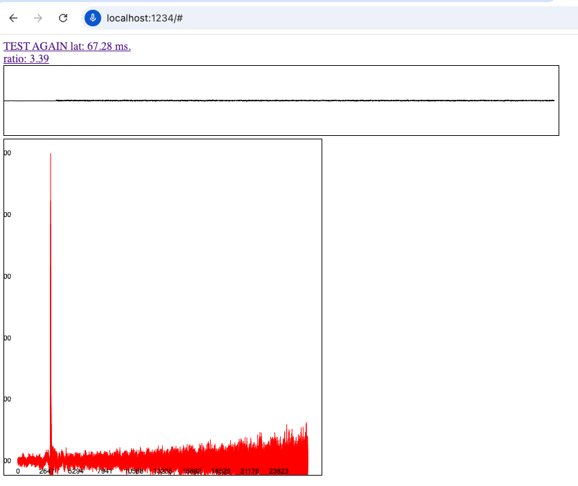

## About

The following repository is a Proof Of Concept to measure the latency in modern web browsers by using a MLS signal (a type of noise). 
The app will play and record the MLS noise using the Web Audio API and will compute the cross correlation to estimate the delay. 
A graph is also displayed showing the resulting peak of the cross correlation and the wave form of audio data recorded.

## How to run it locally:

Requirement: Node.js v14

1. `git clone https://github.com/gilpanal/weblatencytest.git`
2. `cd weblatencytest`
3. `npm i`
4. `npm run dev`
5. Navigate to `localhost:1234`
