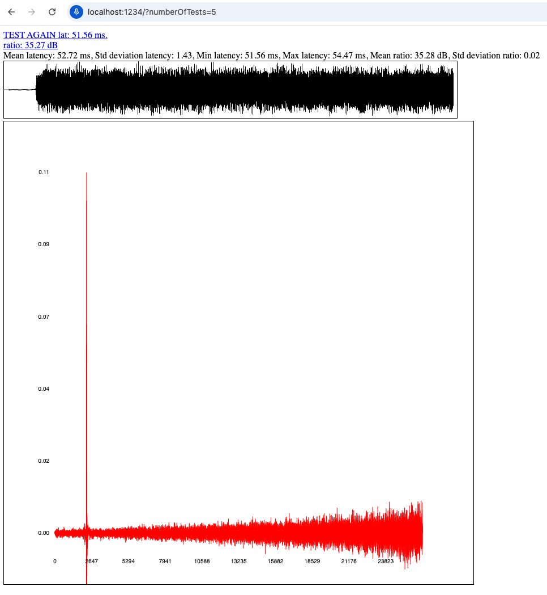
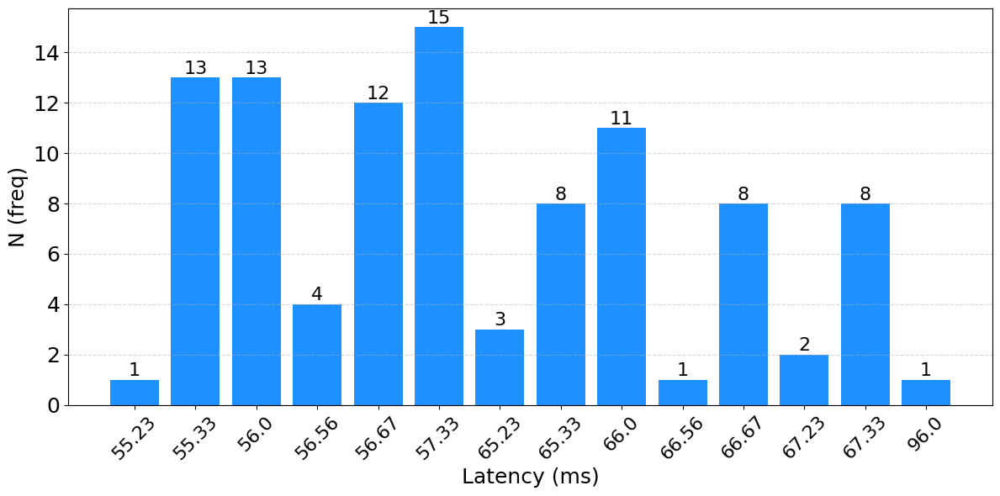

# weblatencytest

Proof-of-concept web app for measuring browser round-trip audio latency using an MLS signal.

## About

This repository is a proof of concept for measuring round-trip audio latency in modern web browsers using an [MLS (Maximum Length Sequence)](https://en.wikipedia.org/wiki/Maximum_length_sequence) signal. The app plays and records MLS noise with the Web Audio API, then computes the cross-correlation to estimate the delay.

The interface displays:

- the recorded waveform
- the cross-correlation peak used for the latency estimate
- a histogram when the test is repeated multiple times

One of the objectives is to compare browsers and operating systems in terms of latency stability and repeatability.

To validate whether a measurement is trustworthy, the app computes a ratio between the correlation peak energy and the rest of the signal energy. In practice, a fixed threshold of `+18 dB` is used: values above that threshold usually indicate a reliable latency estimate, while lower values often point to a poor capture or an invalid test configuration.

The same method is also implemented in the [Hi-Audio online platform](https://hiaudio.fr), an open-source collaborative browser-based DAW, as a practical demonstration of its applicability in real-world web-audio environments.



## Run locally

Requirement: Node.js v14 or above

1. `git clone https://github.com/gilpanal/weblatencytest.git`
2. `cd weblatencytest`
3. `npm install`
4. `npm run dev`
5. Open `http://localhost:1234`

## How to use the demo

1. Allow microphone access when the browser asks for permission.
2. If the wake-lock prompt appears, click `Enable` to keep the screen awake during testing.
3. Click `TEST LATENCY` to start a measurement.
4. Wait for the app to play the MLS signal, record the response, and display the result.
5. To perform several consecutive tests, use the query parameter `numberOfTests`, for example: `http://localhost:1234/?numberOfTests=5`

## Test setup and interpretation

- The tool measures round-trip latency by playing the MLS signal through the browser output and capturing it again through the microphone input.
- For meaningful results, use a stable acoustic or wired loopback setup with clearly audible output and minimal background noise.
- The reported latency is displayed in milliseconds together with a correlation ratio in dB.
- A ratio above `18 dB` generally indicates a successful test. Lower values suggest the measurement may be unreliable.
- If a run looks wrong, check microphone permissions, output volume, input/output routing, browser audio processing, and environmental noise.

## Notes and limitations

- The app requests microphone access as soon as it loads.
- The measurement depends on browser support for `getUserMedia`, Web Audio, Web Workers, and `MediaRecorder`.
- Safari receives special handling in the implementation to compensate for low input gain in some configurations.
- Results can vary substantially depending on the browser, operating system, hardware, and audio routing setup.

## Known browser behavior

- Browser latency values and stability can differ noticeably across Chrome, Chromium, Edge, Firefox, and Safari.
- Firefox produced the most stable results in the experiments documented below, but actual performance still depends on the device and audio setup.
- On Safari, microphone behavior may require additional gain compensation depending on the version and input configuration.

## Results and discussion

The table below presents results from experiments conducted for [the paper presented](https://doi.org/10.5281/zenodo.17642262) at [WAC 2025](https://wac-2025.ircam.fr/). Round-trip latency values were obtained over 100 consecutive tests for different browsers and systems. The table reports the mean latency, standard deviation, and the corresponding minimum and maximum values, all expressed in milliseconds (ms).

| **System / Browser**       | **Mean (ms)** | **Std. Dev. (ms)** | **Min (ms)** | **Max (ms)** |
|----------------------------|---------------|---------------------|--------------|--------------|
| **HP Ubuntu 22.04**        |               |                     |              |              |
| Chrome                     | 64.50         | 7.94                | 49.37        | 85.17        |
| Chromium                   | 64.15         | 8.21                | 41.41        | 76.44        |
| Firefox                    | 65.69         | 0.00                | 65.69        | 65.69        |
| **Lenovo Windows 10**      |               |                     |              |              |
| Edge                       | 60.82         | 6.06                | **55.23**    | **96.00**    |
| Chrome                     | 62.84         | 2.44                | 61.42        | 73.42        |
| Firefox                    | 104.65        | 0.00                | 104.65       | 104.65       |
| **MacBook Pro 2021**       |               |                     |              |              |
| Safari                     | 100.02        | 0.00                | 100.02       | 100.02       |
| Chrome                     | 52.33         | 1.14                | 49.98        | 52.88        |
| Firefox                    | 38.89         | 0.00                | 38.89        | 38.89        |


Firefox demonstrated the most stable performance, with the standard deviation frequently being zero or near-zero. This indicates that the latency values remained consistent across trials, which is desirable for accurate latency compensation. In contrast, Chromium-based browsers such as Chrome and Edge exhibited greater variability, with standard deviations around 8 ms on some Ubuntu and Windows systems. Safari on macOS also showed good stability, although the latency values were generally higher than those obtained with Firefox on the same system.

The following figure illustrates a representative case using a Lenovo laptop running Windows 10 and Microsoft Edge. The histogram shows latency values ranging from a minimum of 55.23 ms to a maximum of 96 ms. With a fluctuation margin of approximately 40 ms, ensuring effective latency compensation becomes challenging. This is especially problematic because the latency test is not typically run continuously by the user, making delay behavior and variability difficult to predict.



---

Below is a comparative table showing round-trip latency values, in milliseconds, obtained in different online DAWs using Firefox when recording an MLS signal. The first column contains the application name together with the device and operating system used. The second column is the round-trip latency obtained by cross-correlating the recorded MLS signal before DAW compensation (see note 5 below for the tool used). The third column is the round-trip latency value provided by the DAW. The fourth column is the remaining latency obtained by cross-correlation after latency compensation when recording the MLS again. For this last column, the target value is `0`.

| **Device / DAW app**  | **MLS latency no comp. (ms)** | **Latency estimation (ms)** | **MLS latency with comp. (ms)** |
| :-------------------- | ----------------------------: | --------------------------: | ------------------------------: |
| **HP Ubuntu 22.04**   |                               |                             |                                 |
| Soundtrap¹            |                       -175.46 |                         249 |                         -182.77 |
| Amped Studio²         |                         38.05 |                          69 |                          -11.38 |
| Bandlab               |                         65.12 |                         139 |                          -73.85 |
| WAM-online studio³    |                         96.96 |                       79.14 |                           58.66 |
| Hi-Audio              |                         66.64 |                       66.39 |                            0.68 |
| **Lenovo Windows 10** |                               |                             |                                 |
| Soundtrap¹            |                        -90.79 |                         314 |                         -179.08 |
| Amped Studio²         |                         55.77 |                         146 |                           -7.96 |
| Bandlab⁴⁵             |                        131.42 |                         147 |                          -14.56 |
| WAM-online studio³⁵   |                        149.12 |                      129.71 |                           53.73 |
| Hi-Audio              |                        138.50 |                      138.44 |                            0.48 |
| **MacBook Pro 2021**  |                               |                             |                                 |
| Soundtrap¹            |                          -184 |                         232 |                         -194.24 |
| Amped Studio⁶         |                             – |                           – |                               – |
| Bandlab               |                         38.71 |                          38 |                            0.73 |
| WAM-online studio³    |                         48.73 |                       36.37 |                           20.66 |
| Hi-Audio              |                         39.07 |                       38.96 |                            1.09 |

---

**Footnotes:**

1. *Soundtrap applies a default compensation before running the actual latency test.*
2. *Amped Studio shows in Settings options a default value of 20 ms for latency compensation in Ubuntu and macOS, and 80 ms for Windows.*
3. *WAM-online studio measures the round-trip but compensates it by subtracting the output latency from the total.*
4. *Bandlab applies preprocessing to the signal, similar to web audio constraints.*
5. *The output volume needs to be increased from 66 to 87 to properly run the latency test.*
6. *Recording from mic not working for Firefox in macOS.*

---

## More info about Hi-Audio

1. Journal article: https://hal.science/hal-05153739v1

2. Hi-Audio online platform: https://hiaudio.fr

3. News: https://hi-audio.imt.fr/2025/03/07/bridging-music-and-research/

4. Hi-Audio web-app repository: https://github.com/idsinge/hiaudio_webapp

5. Python/Google Colab notebook for MLS-based latency estimation: https://gist.github.com/gilpanal/f6a64a8fe797190bba22123dfea29611

---

## Acknowledgments

This work is developed as part of the project *Hybrid and Interpretable Deep Neural Audio Machines*, funded by the **European Research Council (ERC)** under the European Union's Horizon Europe research and innovation programme (grant agreement No. 101052978).


We also thank [Louis Bahrman](https://github.com/Louis-Bahrman) for his collaboration on this project, including his contributions to the [Python/Google Colab notebook for MLS-based latency estimation](https://gist.github.com/gilpanal/f6a64a8fe797190bba22123dfea29611).

---

## How to cite

If you use or reference the data or findings from this repository, please cite the published conference paper. You may also cite the repository directly.

> Gil Panal, J. M., Richard, G., & David, A. (2025). A Maximum Length Sequence–Based Method for Robust Round-Trip Latency Estimation in online Digital Audio Workstations. In *Proceedings of the Web Audio Conference (WAC 2025)*. https://doi.org/10.5281/zenodo.17642262

**BibTeX:**

```bibtex
@inproceedings{GilPanal2025wac,
  author    = {Gil Panal, Jos{\'e} M. and Richard, Ga{\"e}l and David, Aur{\'e}lien},
  title     = {A Maximum Length Sequence--Based Method for Robust Round-Trip Latency Estimation in online Digital Audio Workstations},
  booktitle = {Proceedings of the Web Audio Conference (WAC 2025)},
  year      = {2025},
  doi       = {10.5281/zenodo.17642262},
  url       = {https://doi.org/10.5281/zenodo.17642262}
}
```

A preprint version is also available at: [https://hal.science/hal-05154354](https://hal.science/hal-05154354)

**Repository citation:**

> Gil Panal, J. M., Richard, G., & David, A. (2024). *weblatencytest* [Software repository]. GitHub. https://github.com/gilpanal/weblatencytest

```bibtex
@misc{GilPanal2024weblatencytest,
  author = {Gil Panal, Jos{\'e} M. and Richard, Ga{\"e}l and David, Aur{\'e}lien},
  title  = {weblatencytest},
  year   = {2024},
  url    = {https://github.com/gilpanal/weblatencytest}
}
```

---

## License

This project is licensed under the [MIT License](LICENSE).  
Copyright (c) 2024 Hi-Audio.
